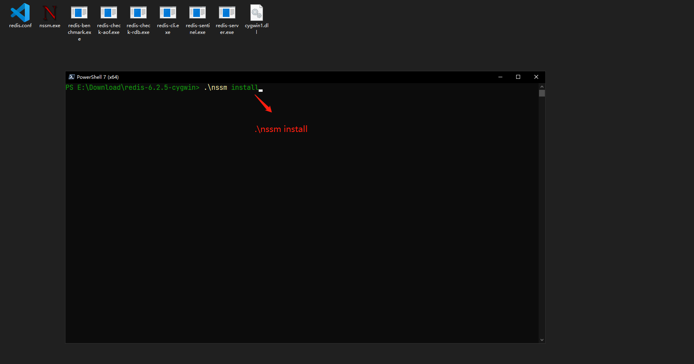
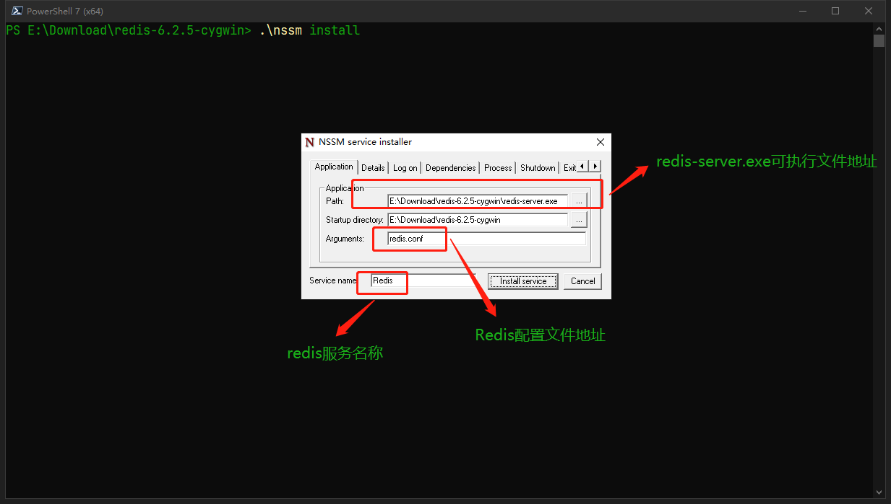
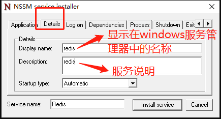
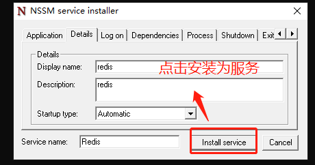

## Windows平台可用的Redis Server
#### 说明:
> 从`Redis`官方源码中编译的`Windows`平台可用的`Redis Server`程序, 分别编译的版本为`cygwin`和`msys2`, 功能上无差别, 可任意选择. 可配合nssm安装为Windows服务开机自启动. 方便Windows环境下Redis的调试和日常开发使用.

#### Windows平台其他版本Redis
1. `tporadowski / redis`
  > `地址`: [https://github.com/tporadowski/redis](https://github.com/tporadowski/redis)
  > `版本`: 5.0.10
  > `说明`:
  >> Native port of Redis for Windows. Redis is an in-memory database that persists on disk. The data model is key-value, but many different kind of values are supported: Strings, Lists, Sets, Sorted Sets, Hashes, Streams, HyperLogLogs. This repository contains unofficial port of Redis to Windows.

2. `microsoftarchive / redis`
  > `地址`: [https://github.com/microsoftarchive/redis](https://github.com/microsoftarchive/redis)
  > `版本`: 3.0.504
  > `说明`:
  >> Redis is an in-memory database that persists on disk. The data model is key-value, but many different kind of values are supported: Strings, Lists, Sets, Sorted Sets, Hashes.

#### 安装为Windows服务
1. 从[此处](https://github.com/X-Lucifer/winredis/releases)任意选择`msys2`或`cygwin`版本下载.
2. 解压之后, 下载[nssm](https://www.nssm.cc/), 并放到当前目录.
3. 以`管理员身份`运行`cmd`或`powershell`, 并执行`.\nssm install`
```shell
.\nssm install
```
4. 打开服务安装窗体, 按图示设置好对应的参数, 点击`install service`按钮即可

参考以下步骤:
1. 第一步 
2. 第二步 
3. 第三步 
4. 第四步 

#### 相关源码和其他软件
1. `Redis`源码: [https://github.com/redis/redis](https://github.com/redis/redis)
2. `Redis`官网: [https://redis.io](https://redis.io/)
3. `MSYS2`: [https://www.msys2.org/](https://www.msys2.org/)
4. `Cygwin`: [https://www.cygwin.com/](https://www.cygwin.com/)
5. `NSSM`: [https://www.nssm.cc/](https://www.nssm.cc/)


